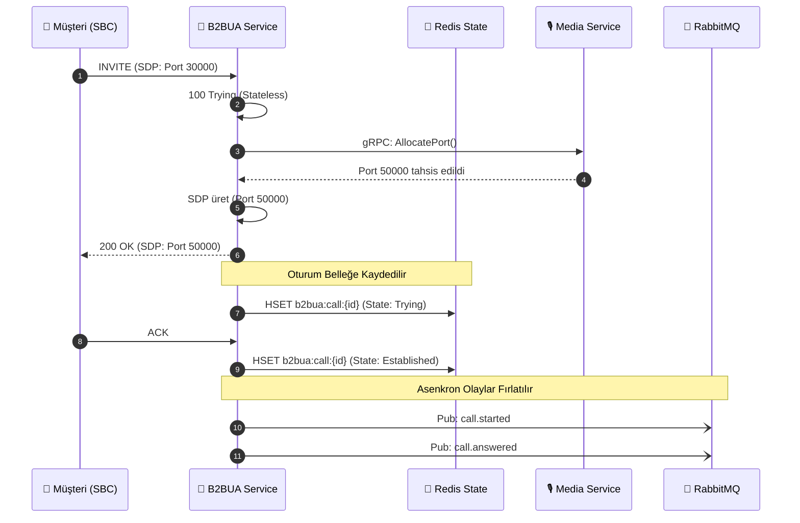

# 🧬 B2BUA Session & State Machine Logic

Bu belge, `sip-b2bua-service`'in ham SIP paketlerini nasıl yönettiğini, oturum durumlarını (State) ve çağrı bacaklarını (Call Legs) nasıl birbirine bağladığını açıklar.

## 1. Back-to-Back User Agent (B2BUA) Mantığı
Geleneksel bir Proxy'den farklı olarak B2BUA, çağrıyı sadece yönlendirmez; çağrıyı kendisi sonlandırır ve karşı tarafa yeni bir çağrı açar. Bu sayede her iki bacağı da (Müşteri <-> SBC ve B2BUA <-> Media) bağımsız olarak yönetebilir.

## 2. Inbound Call Flow (Diyagram)
Aşağıdaki diyagram, bir dış aramanın nasıl karşılandığını ve `media-service` üzerinden nasıl izole bir port tahsis edildiğini gösterir:

## 3. Erken İptal Koruması (Early Cancel Prevention)
İstemci `INVITE` gönderdikten hemen sonra `CANCEL` gönderirse ve bu esnada B2BUA henüz `200 OK` dönmemişse bir yarış durumu (Race Condition) oluşur.
* **Çözüm:** Sistem, `process_cancel` tetiklendiğinde `early_cancelled` setine Call-ID'yi yazar. `process_invite` tamamlandığında bu seti kontrol eder ve eğer çağrı iptal edilmişse `media-service` portunu derhal iade ederek askıda (zombie) port kalmasını engeller.
